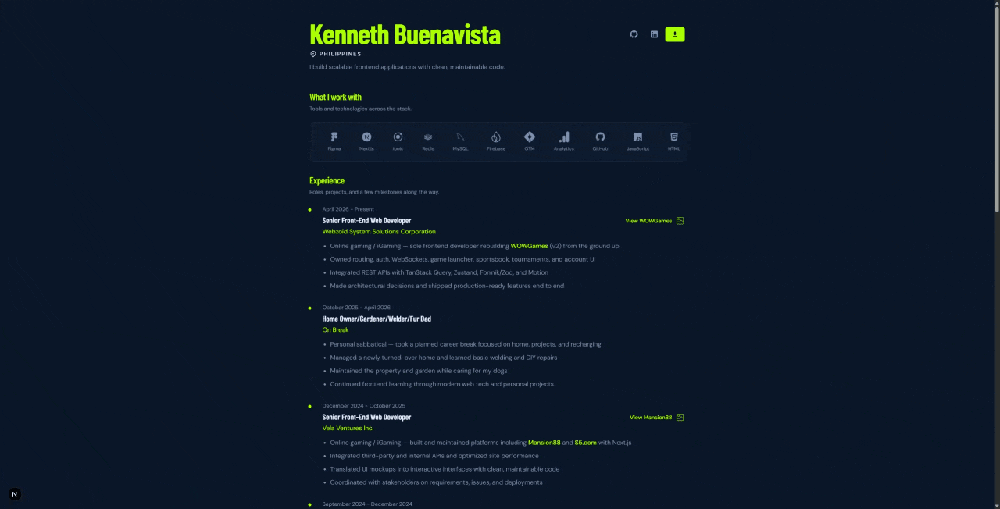

# Kenneth Buenavista — Portfolio

Personal portfolio for **Kenneth Buenavista**, a senior frontend developer based in the Philippines. Built with Next.js, React, and Tailwind — focused on clean UI, real project work, and a gated resume download flow.

**Live:** [kbuenavista.com](https://kbuenavista.com)

## Demo



## What's inside

### Home
- **Profile** — name, rotating intro lines, social links, and Google-authenticated resume download
- **Skills marquee** — tools and technologies across the stack (React, Next.js, TypeScript, Angular, and more)
- **Experience timeline** — career history with highlights, company links, and deep links into featured projects and activities

### Project pages
Detail pages with write-ups, screenshots/GIFs, and tech stacks (icons for known tools, bullets for the rest):

| Project | Stack focus |
|---------|-------------|
| [WOWGames](https://kbuenavista.com/projects/wowgames) | Next.js, React, TypeScript, Tailwind, Zustand, TanStack Query |
| [Game99](https://kbuenavista.com/projects/w-bridges) | Next.js, React, multi-theme UI |
| [Mansion88](https://kbuenavista.com/projects/mansion88) | Next.js, React, GTM / Analytics |
| [Cebu Pacific Air](https://kbuenavista.com/projects/collabera) | Angular, TypeScript, Figma-driven UI |
| [Manulife ID](https://kbuenavista.com/projects/tcs) | Angular, CI/CD, production support tooling |

### Also included
- **About (`/me`)** — personal section and background
- **Activities** — e.g. [NG-MY 2019](https://kbuenavista.com/activities/ng-my-2019) Angular conference write-up with media
- **Privacy policy** — how Google sign-in is used for resume downloads
- **Route top loader** — brand neon progress bar on navigation
- **Vercel Analytics** — visit tracking

## Stack

- **Next.js 16** (App Router) + **React 19** + **TypeScript**
- **Tailwind CSS v4**
- Typed local content in `content/` (via `lib/content`)
- **Firebase** Google Auth + Firestore resume download logging
- **pnpm**

## Setup

```bash
pnpm install
pnpm dev
```

Copy Firebase env vars into `.env.local` (see [`FIREBASE_SETUP.md`](./FIREBASE_SETUP.md)).

| Command | Description |
|---------|-------------|
| `pnpm dev` | Development server |
| `pnpm build` | Production build |
| `pnpm start` | Start production server |
| `pnpm lint` | ESLint |

## Links

- Site: [kbuenavista.com](https://kbuenavista.com)
- GitHub: [KennethicEnergy](https://github.com/KennethicEnergy)
- LinkedIn: [ken-buenavista](https://www.linkedin.com/in/ken-buenavista-94a736144/)
